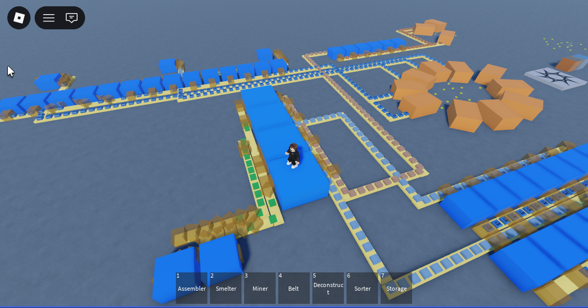
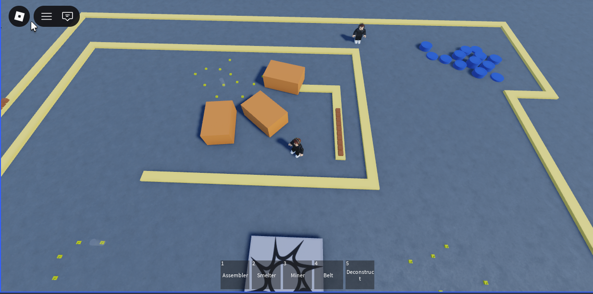
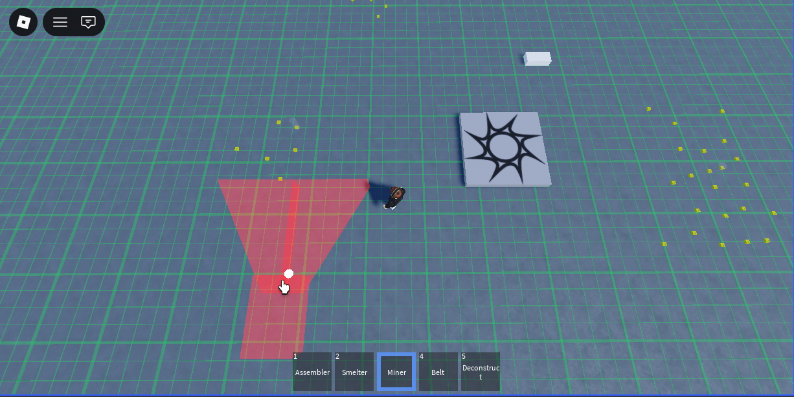
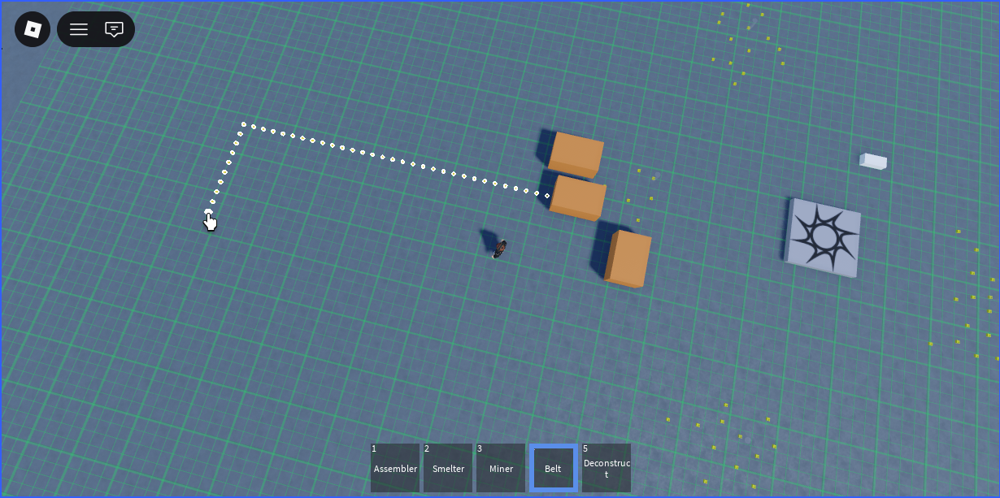
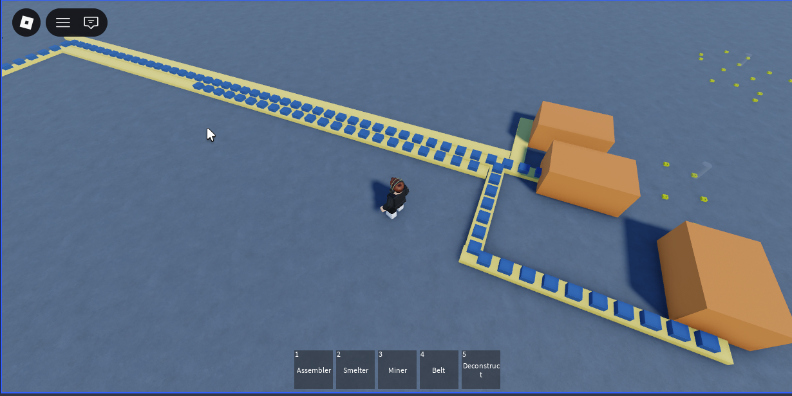

# Factory Game Roblox
Jogo de construção e automação no estilo Factorio no plataforma roblox. Atualmente a simulação de produção é feita apenas no client e suportar apenas mouse e teclado. Suporte à multiplayer ainda será avalidado.







## Getting Started
To build the place from scratch, use:

```bash
rojo build -o "factory-game.rbxlx"
```

Next, open `factory-game.rbxlx` in Roblox Studio and start the Rojo server:

```bash
rojo serve
```

For more help, check out [the Rojo documentation](https://rojo.space/docs).